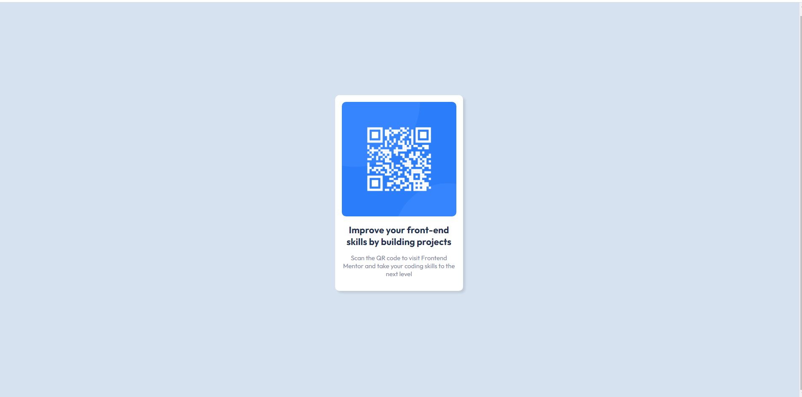
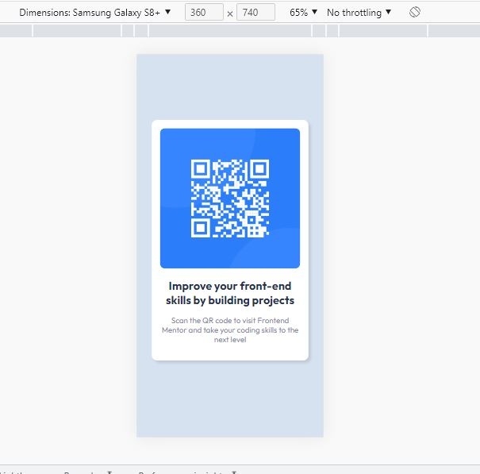

# FrontEndMentor-QR-code-component

This is a solution to the [QR code component challenge on Frontend Mentor](https://www.frontendmentor.io/challenges/qr-code-component-iux_sIO_H). Frontend Mentor challenges help you improve your coding skills by building realistic projects. 

## Table of contents

- [Overview](#overview)
  - [Screenshot](#screenshot)
  - [Links](#links)
- [My process](#my-process)
  - [Built with](#built-with)
  - [What I learned](#what-i-learned)
  - [Continued development](#continued-development)
- [Author](#author)
- [Acknowledgments](#acknowledgments)


## Overview

### Screenshot





### Links

- Solution URL: (https://github.com/gmathankumar/FrontEndMentor-QR-code-component)
- Live Site URL: 

## My process

### Built with

- Semantic HTML5 markup
- CSS custom properties
- Flexbox


### What I learned

For me it was very dificult to choose the right properties in css to get the body and the .card to work and be seen as the style guide declared.

At the end, i believe i did a good job with the things that i used.
Always open to any comments


```css
.body {
    background-color:var(--Light-gray);
    font-size: 15px;
    font-family: 'Outfit', sans-serif;
    display: flex;
    flex-direction: column;
    align-items: center;
    justify-content: center;
    height: 100vh;
    text-align: center;
}

```

### Continued development

I would like to reuse the card component in any of my upcoming projects.


## Author

- Frontend Mentor - [@gmathankumar](https://www.frontendmentor.io/profile/gmathankumar)

## Acknowledgments


At some point i was a little stuck with setting the style for the image. And i found the below Github reposistory usefull.

(https://github.com/Arekkusu17/QR-code-component-challenge)
